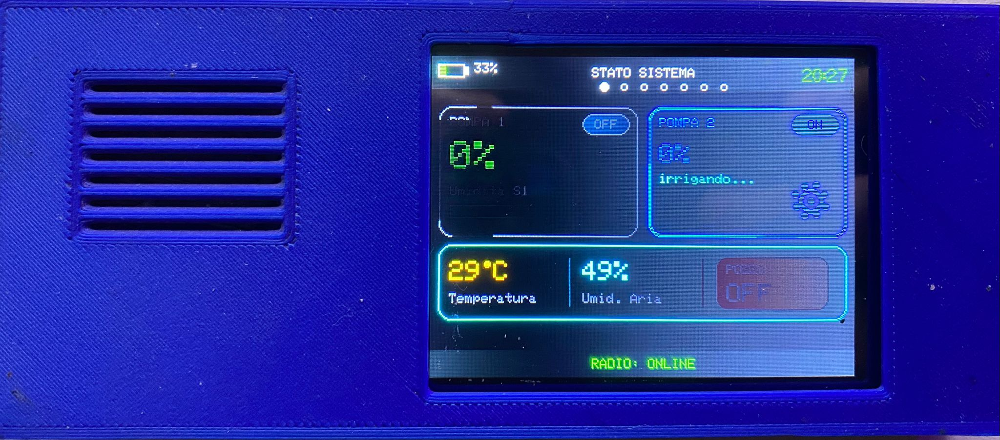
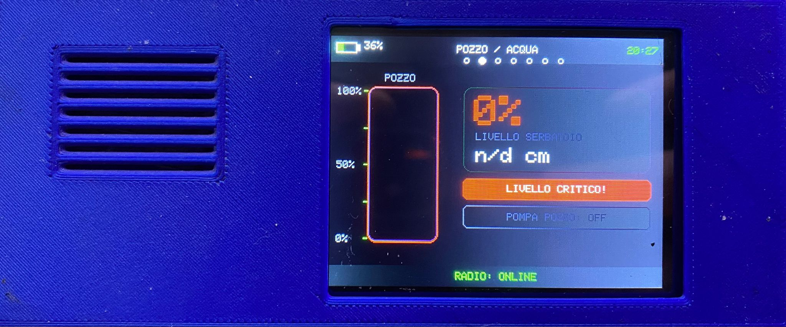
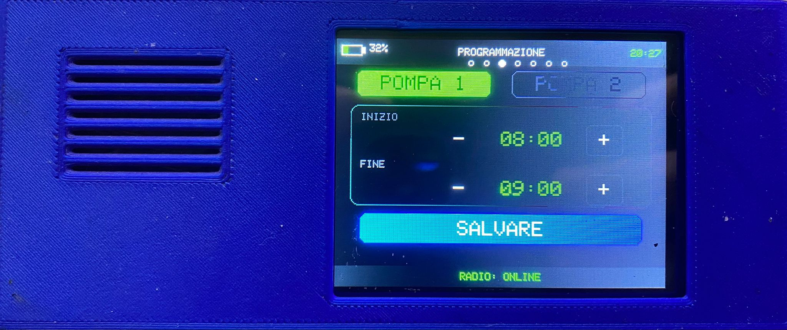
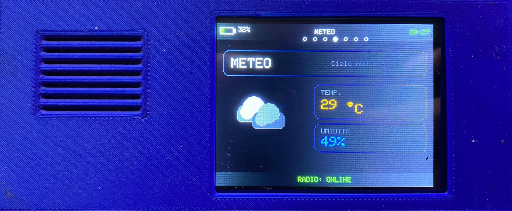
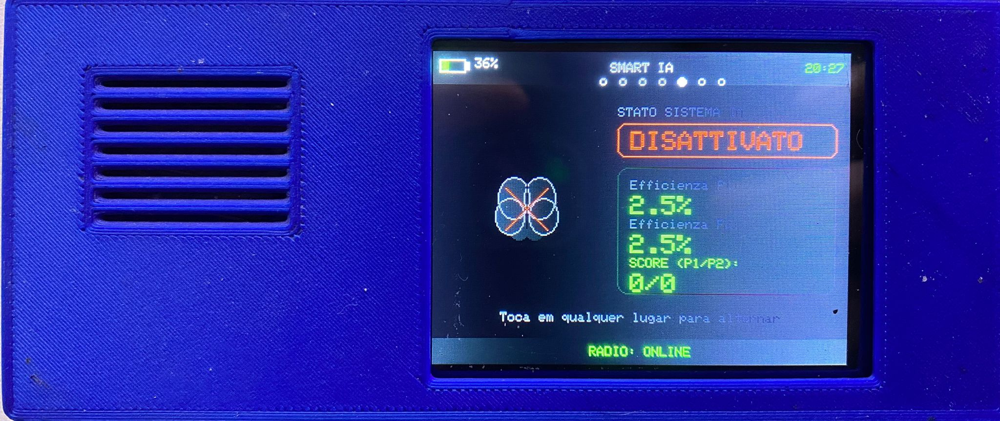
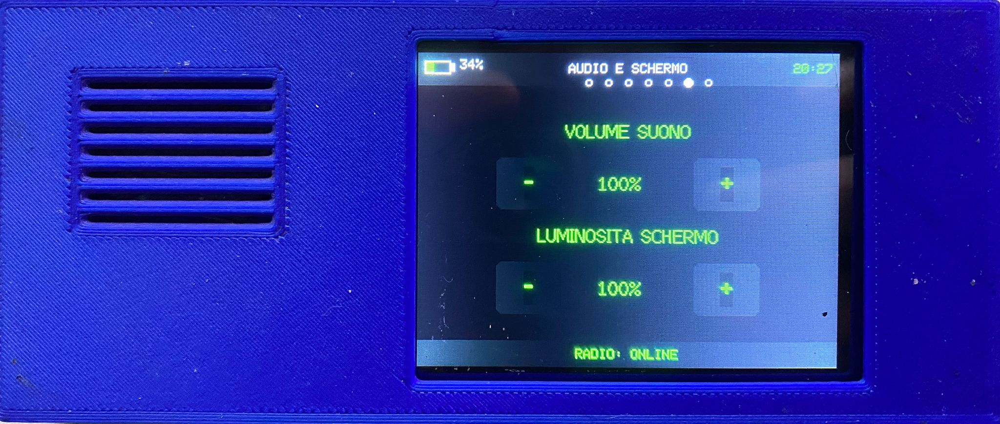
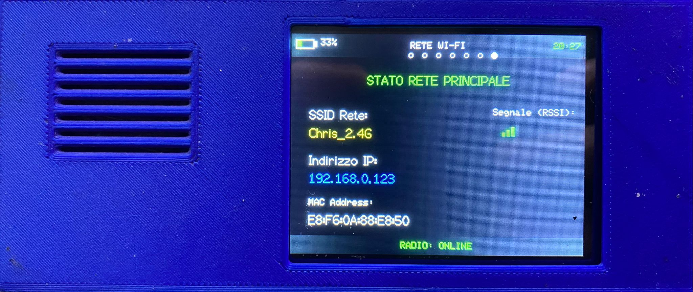

# Tech3D Remote Control

**Pannello di controllo remoto wireless per il sistema ESP32 Smart Irrigation**

Il **Tech3D Remote Control** è un'interfaccia embedded sviluppata con **ESP32**, display **TFT 320×240** e touch resistivo **XPT2046**, progettata per comunicare con il sistema principale **ESP32 Smart Irrigation** tramite **ESP-NOW**.

Il dispositivo permette di monitorare lo stato dell'impianto e interagire con alcune delle principali funzioni del sistema attraverso un'interfaccia grafica dedicata.

> **Portfolio tecnico:** il firmware sorgente non è incluso in questo repository. Il progetto documenta l'architettura, l'interfaccia utente, la comunicazione wireless e le soluzioni tecniche sviluppate.

---

## Panoramica

Il progetto utilizza un'architettura embedded distribuita composta da due nodi principali:

```text
┌─────────────────────────────────┐
│      ESP32 SMART IRRIGATION     │
│         Controller              │
│                                 │
│  Sensori                        │
│  Pompe                          │
│  Logica irrigazione             │
│  SMART IA                       │
│  Meteo                          │
│  Wi-Fi                          │
│  Web Server                     │
│  Telegram                       │
└───────────────┬─────────────────┘
                │
                │ ESP-NOW
                │
                ▼
┌─────────────────────────────────┐
│       TECH3D REMOTE CONTROL     │
│                                 │
│  ESP32                          │
│  TFT 320×240                    │
│  XPT2046 Touch                  │
│  Interfaccia grafica            │
│  Touch + Swipe                  │
└─────────────────────────────────┘
```

Il controller principale rimane responsabile della gestione dell'impianto, mentre il Remote Control funziona come **nodo di interfaccia e controllo remoto**.

---

# Caratteristiche principali

* **ESP32** come microcontrollore
* Display **TFT 320×240** in modalità landscape
* Touch resistivo **XPT2046**
* Comunicazione wireless tramite **ESP-NOW**
* Interfaccia grafica embedded
* Navigazione tramite **touch e swipe**
* Monitoraggio dello stato del sistema
* Controllo remoto delle pompe
* Controllo della pompa del pozzo
* Programmazione dell'irrigazione
* Monitoraggio del livello dell'acqua
* Visualizzazione delle informazioni meteorologiche
* Monitoraggio del sistema **SMART IA**
* Visualizzazione delle informazioni Wi-Fi
* Regolazione locale di volume e luminosità
* Indicazione dello stato della comunicazione radio
* Modalità sleep automatica del display
* Feedback visivo e sonoro

---

# Interfaccia Utente

L'interfaccia è stata progettata per un display compatto **320×240**, con particolare attenzione alla leggibilità e alla facilità di utilizzo tramite touch resistivo.

La navigazione comprende **7 schermate principali**.

## 01 — STATO SISTEMA

Panoramica generale del sistema di irrigazione.

Visualizza:

* stato Pompa 1;
* stato Pompa 2;
* stato del pozzo;
* umidità del terreno;
* temperatura;
* umidità dell'aria;
* informazioni meteo;
* stato della comunicazione radio.

La schermata permette inoltre di interagire direttamente con le pompe.



---

## 02 — POZZO / ACQUA

Schermata dedicata alla gestione e al monitoraggio dell'acqua.

Visualizza:

* livello del serbatoio;
* percentuale di acqua disponibile;
* stato del pozzo;
* stato della pompa del pozzo;
* rappresentazione grafica del livello dell'acqua.



---

## 03 — PROGRAMMAZIONE

Interfaccia per la configurazione degli orari di irrigazione.

È possibile selezionare:

* **Pompa 1**
* **Pompa 2**

e modificare:

* ora di inizio;
* ora di fine;
* programmazione associata alla pompa.

Gli orari possono essere modificati direttamente tramite i controlli touch.



---

## 04 — METEO

Visualizzazione delle informazioni meteorologiche ricevute dal sistema principale.

La schermata può mostrare:

* condizioni meteorologiche;
* descrizione del tempo;
* temperatura;
* umidità;
* stato del servizio meteorologico.

L'interfaccia utilizza elementi grafici animati per rappresentare le condizioni atmosferiche.



---

## 05 — SMART IA

Interfaccia dedicata al sistema di irrigazione adattivo **SMART IA**.

Visualizza:

* stato SMART;
* modalità attiva/disattiva;
* efficienza Pompa 1;
* efficienza Pompa 2;
* score del sistema.

La modalità SMART può essere modificata direttamente tramite touch.



---

## 06 — AUDIO E SCHERMO

Schermata dedicata alla configurazione locale dell'interfaccia.

Permette di modificare:

* volume del sistema;
* luminosità del display.

Le modifiche vengono applicate direttamente al dispositivo.



---

## 07 — RETE WI-FI

Schermata informativa relativa alla connettività della rete principale.

Visualizza:

* SSID;
* intensità del segnale RSSI;
* indirizzo IP;
* indirizzo MAC;
* stato della rete.



---

# Navigazione

La navigazione è stata progettata per sfruttare le caratteristiche del touch resistivo.

Sono disponibili due modalità di interazione:

### Touch

Utilizzato per:

* attivare/disattivare funzioni;
* modificare parametri;
* selezionare pompe;
* configurare gli orari;
* modificare volume e luminosità;
* attivare/disattivare SMART IA.

### Swipe

Le gesture orizzontali permettono di passare rapidamente da una schermata all'altra.

```text
STATO SISTEMA
      ↓
POZZO / ACQUA
      ↓
PROGRAMMAZIONE
      ↓
METEO
      ↓
SMART IA
      ↓
AUDIO E SCHERMO
      ↓
RETE WI-FI
```

La gestione dello swipe è separata dalla gestione dei comandi touch per evitare attivazioni accidentali durante la navigazione.

---

# Comunicazione ESP-NOW

Il Remote Control comunica con il controller principale attraverso **ESP-NOW**.

```text
        ESP32-S3
   Smart Irrigation
          │
          │
       ESP-NOW
          │
          ▼
         ESP32
   Remote Control
          │
          ▼
      TFT + Touch
```

La comunicazione è bidirezionale.

### Controller principale → Remote Control

Il sistema principale invia informazioni relative a:

* sensori;
* pompe;
* pozzo;
* livello dell'acqua;
* temperatura;
* umidità;
* meteo;
* programmazione;
* SMART IA;
* rete Wi-Fi;
* stato del sistema.

### Remote Control → Controller principale

Il Remote Control può inviare comandi relativi a:

* Pompa 1;
* Pompa 2;
* pompa del pozzo;
* programmazione;
* modalità SMART IA;
* alcune funzioni di sistema.

Il Remote Control non gestisce direttamente la logica dell'impianto: i comandi vengono elaborati dal controller principale.

---

# Architettura del Sistema

Il progetto segue un'architettura **distributed embedded system**, separando la logica di controllo dall'interfaccia utente.

```text
                    MAIN SYSTEM
┌─────────────────────────────────────────┐
│ ESP32-S3 Smart Irrigation               │
│                                         │
│ Sensori                                 │
│ Pompe                                   │
│ Logica di irrigazione                   │
│ SMART IA                                │
│ Meteo                                   │
│ Wi-Fi                                   │
│ Web Server                              │
│ Telegram                                │
└────────────────────┬────────────────────┘
                     │
                     │ ESP-NOW
                     │
                     ▼
┌─────────────────────────────────────────┐
│ Tech3D Remote Control                   │
│                                         │
│ ESP32                                   │
│ Comunicazione                           │
│ Gestione Touch                          │
│ Gestione Swipe                          │
│ Logica UI                               │
└────────────────────┬────────────────────┘
                     │
                     ▼
             ┌─────────────────┐
             │   TFT 320×240   │
             │   XPT2046 Touch │
             └─────────────────┘
```

Il diagramma completo dell'architettura è disponibile in:

**[`docs/architettura.svg`](docs/architettura.svg)**

---

# Hardware

| Componente       | Tecnologia               |
| ---------------- | ------------------------ |
| Microcontrollore | ESP32                    |
| Display          | TFT 240×320 fisico       |
| Canvas           | 320×240 landscape        |
| Touch            | XPT2046 resistivo        |
| Comunicazione    | ESP-NOW                  |
| Audio            | Buzzer / feedback sonoro |
| Backlight        | PWM                      |
| Batteria         | Lettura ADC              |
| Indicatori       | LED RGB                  |

---

# Funzioni Embedded

Il progetto integra diverse funzionalità tipiche dei sistemi embedded:

* gestione delle periferiche;
* gestione del display;
* gestione del touch;
* rilevamento delle gesture;
* comunicazione wireless;
* gestione della batteria;
* controllo del backlight;
* gestione LED di stato;
* feedback sonoro;
* animazioni grafiche;
* modalità sleep;
* gestione dello stato di comunicazione;
* aggiornamento dinamico dell'interfaccia.

---

# Feedback e Stato della Comunicazione

Il sistema fornisce un'indicazione visiva dello stato della comunicazione wireless.

```text
RADIO: ONLINE
```

oppure:

```text
RADIO: DISCONNESSO
```

Lo stato viene determinato sulla base della ricezione della telemetria proveniente dal controller principale.

Il Remote Control utilizza inoltre indicatori LED per rappresentare lo stato della comunicazione.

---

# Progettazione dell'Interfaccia

L'interfaccia è stata sviluppata tenendo conto delle limitazioni fisiche di un display embedded di piccole dimensioni.

Principali criteri progettuali:

* informazioni organizzate per priorità;
* elementi touch facilmente identificabili;
* pulsanti sufficientemente grandi;
* feedback visivo immediato;
* navigazione semplice;
* separazione tra visualizzazione e controllo;
* uso di animazioni per rappresentare stati dinamici;
* indicazione permanente dello stato radio.

L'obiettivo è ottenere un'interfaccia simile a un piccolo **HMI embedded**, utilizzabile senza PC o smartphone.

---

# Competenze Tecniche Dimostrate

### Embedded Systems

* ESP32
* ESP32-S3
* C/C++
* Arduino framework
* GPIO
* ADC
* PWM
* gestione periferiche

### Wireless Communication

* ESP-NOW
* comunicazione ESP32 → ESP32
* comunicazione bidirezionale
* sistemi embedded distribuiti
* gestione dello stato della comunicazione

### HMI / User Interface

* TFT
* XPT2046
* touch resistivo
* interfacce grafiche embedded
* touch interaction
* swipe gestures
* animazioni
* feedback visivo e sonoro

### System Integration

* integrazione con sistema di irrigazione;
* comunicazione tra nodi embedded;
* monitoraggio remoto;
* gestione di comandi remoti;
* progettazione di interfacce dedicate;
* integrazione hardware/software.

---

# Struttura del Repository

```text
remote-control/
│
├── README.md
│
├── docs/
│   ├── DOCUMENTAZIONE.md
│   ├── ARCHITECTURE.md
│   └── architettura.svg
│
└── images/
    ├── remote-00.jpeg
    ├── remote-01.jpeg
    ├── remote-02.jpeg
    ├── remote-03.jpeg
    ├── remote-04.jpeg
    ├── remote-05.jpeg
    └── remote-06.jpeg
```

Il firmware sorgente non è incluso nel repository pubblico.

Il repository è stato strutturato come **documentazione tecnica e portfolio professionale**.

---

# Documentazione

Per approfondire gli aspetti tecnici del progetto:

### Architettura

[`docs/ARCHITECTURE.md`](docs/ARCHITECTURE.md)

Descrive:

* architettura del sistema;
* separazione delle responsabilità;
* comunicazione ESP-NOW;
* flusso dei dati;
* struttura dell'interfaccia;
* navigazione;
* principi progettuali.

### Documentazione Tecnica

[`docs/DOCUMENTAZIONE.md`](docs/DOCUMENTAZIONE.md)

Contiene la documentazione tecnica dettagliata del progetto, inclusi:

* hardware;
* mappatura dei pin;
* strutture di comunicazione;
* protocollo ESP-NOW;
* gestione della telemetria;
* gestione dei comandi;
* architettura della UI;
* coordinate touch;
* gestione swipe;
* modalità sleep;
* audio;
* boot;
* manutenzione;
* dettagli delle sette schermate.

### Diagramma di Architettura

[`docs/architettura.svg`](docs/architettura.svg)

Rappresentazione grafica dell'architettura del sistema.

---

# Relazione con ESP32 Smart Irrigation

Il Tech3D Remote Control fa parte dell'ecosistema **ESP32 Smart Irrigation**.

I due progetti sono mantenuti come repository separati per rappresentare in modo chiaro le diverse responsabilità tecniche.

```text
┌───────────────────────────────┐
│ ESP32 Smart Irrigation        │
│                               │
│ Controller principale         │
│ Sensori                       │
│ Pompe                         │
│ Logica irrigazione            │
│ SMART IA                      │
└───────────────┬───────────────┘
                │
                │ ESP-NOW
                │
                ▼
┌───────────────────────────────┐
│ Tech3D Remote Control         │
│                               │
│ Interfaccia HMI wireless      │
│ ESP32 + TFT + Touch           │
└───────────────────────────────┘
```

Questa separazione permette di presentare il Remote Control come un **progetto embedded autonomo**, mantenendo allo stesso tempo una chiara relazione con il sistema principale.

---

# Stato del Progetto

**Stato:** Completato / documentato
**Tipologia:** Embedded / IoT / HMI
**Piattaforma:** ESP32
**Display:** TFT 320×240
**Touch:** XPT2046
**Comunicazione:** ESP-NOW
**Firmware:** C++ / Arduino
**Interfaccia:** TFT Touch UI
**Navigazione:** Touch + Swipe
**Architettura:** Distributed Embedded System
**Codice sorgente:** Non incluso
**Finalità:** Portfolio tecnico

---

# Obiettivo Professionale

Il progetto è presentato come esempio pratico di progettazione e integrazione di un sistema embedded composto da:

```text
Hardware
   +
Firmware
   +
Wireless Communication
   +
Embedded HMI
   +
System Integration
```

L'obiettivo è dimostrare la capacità di progettare un'interfaccia embedded completa, integrarla con un sistema reale e gestire la comunicazione tra più dispositivi microcontrollore.

---

## Tech3D

**Embedded Systems • ESP32 • IoT • HMI • Wireless Communication**
